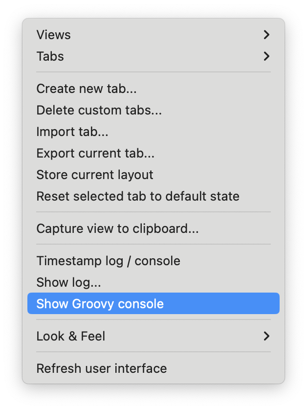
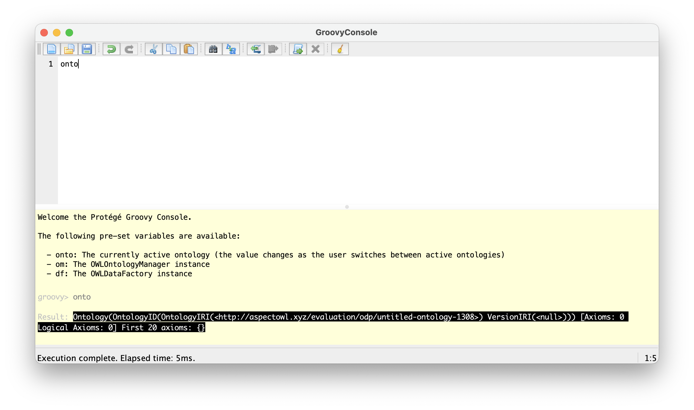

# Protege Groovy Console Plug-In

A plug-in for the [Protege 5](https://protege.stanford.edu) OWL ontology editor.

The plug-in allows to open a [Groovy Console](https://docs.groovy-lang.org/latest/html/documentation/groovy-console.html) from inside Protege, providing direct programmatic access to the loaded ontologies.

## Installation

1. Download [the latest release](https://github.com/RalphBln/Protege-Groovy-Console/releases/latest).
2. Move the JAR file from your Downloads directory to the "plugins" subdirectory of your Protege distribution.

## Usage

The plug-in adds a menu item under Protege's "Window" menu.

Select "Window" -> "Show Groovy Console".

A Groovy console will open in a separate window.

The console has some variables pre-defined:

- 'onto': The currently active ontology (the value changes as the user switches between active ontologies)
- 'om': The OWLOntologyManager instance
- 'df': The OWLDataFactory instance

Furthermore, the OWLAPI package `org.semanticweb.owlapi.model` is imported.

For learning how to use the Groovy Console, please refer to the [Groovy Console documentation](https://docs.groovy-lang.org/latest/html/documentation/groovy-console.html).

Interaction with the ontologies and Protege's underlying datamodel is effected using the [OWL API](http://owlcs.github.io/owlapi/).
Please refer to the [OWL API version 4 documentation](http://owlcs.github.io/owlapi/apidocs_4/index.html) (which is the version used by Protege 5).
